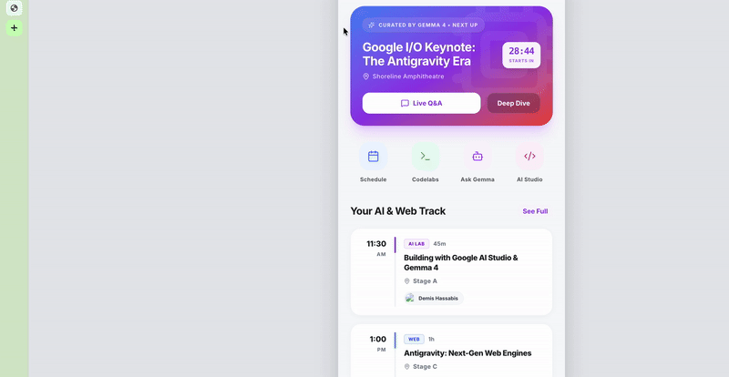
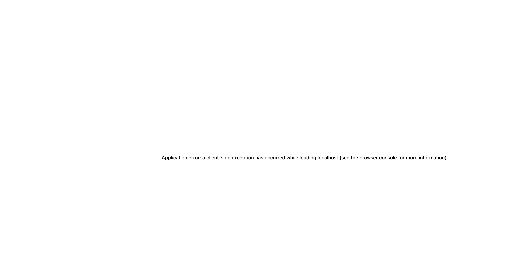

# Google I/O 2026 Concierge




A personalized, local-first schedule and guide for Google I/O 2026 powered by Gemma 4 and the Antigravity Engine.

## Quick Start
```bash
git clone https://github.com/andrewvoirol/ais-google-i-o-concierge.git
cd ais-google-i-o-concierge
npm install
npm run dev
```

## How It Works
- **Local-First AI:** Built with Gemma 4 for on-device natural language interaction and session recommendations.
- **Offline Mode:** The entire schedule and your notes are cached locally, ensuring you're never without your itinerary, even if conference Wi-Fi is flaky.
- **Interactive Map & AR:** (Demo UI) Simulates live directions to stages using Antigravity's next-gen web rendering.

## Tech Stack
| Category | Technology |
|---|---|
| Framework | Next.js 15, React 19 |
| Styling | Tailwind CSS v4 |
| Animations | Motion |
| Icons | Lucide React |
