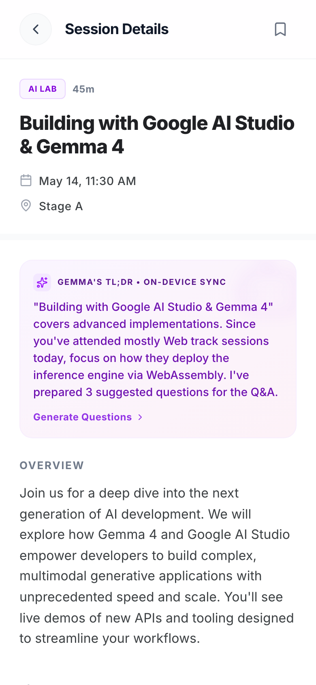
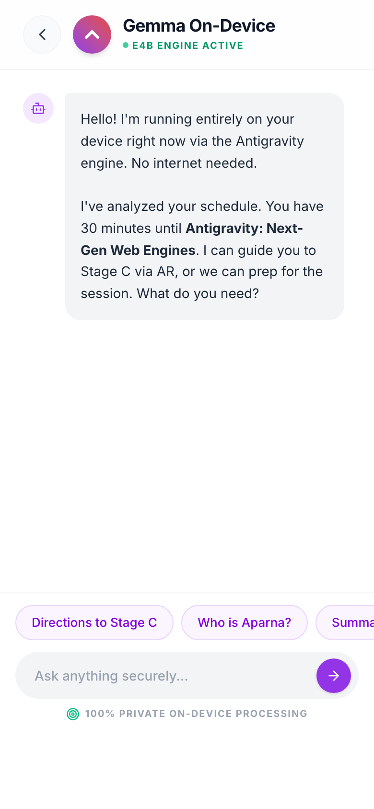

# Google I/O 2026 Concierge


A polished, local-first mobile companion app concept for Google I/O 2026 — built as a high-fidelity UI prototype in a single weekend. Imagines a world where Gemma 4 runs on-device to give you personalized session recommendations, AR wayfinding, and a private AI assistant that works even when the conference Wi-Fi inevitably dies.

## Quick Start

```bash
git clone https://github.com/AndrewVoirol/ais-google-i-o-concierge.git
cd ais-google-i-o-concierge
npm install
npm run dev
```

## What You Can Do

- **Browse your personalized schedule** — tap any session card for deep-dive details, speaker bios, and related sessions
- **Chat with Gemma On-Device** — a private AI assistant with contextual awareness of your schedule, quick reply suggestions, and zero network dependency
- **Save sessions & get notified** — bookmark sessions from the detail view, toggle push notifications for 15-minute reminders
- **Take private notes** — each session has a local-first note field that syncs when you're back online
- **Works offline** — a service worker caches the full schedule so flaky Wi-Fi doesn't leave you stranded

## App States

| Dashboard | Session Detail | Gemma Chat |
|:-:|:-:|:-:|
|  |  |  |

## How It Works

The entire app is a single-page React client. Navigation uses hash routing (`#session-ses1`, `#gemma`, `#profile`) with animated transitions powered by Motion. Session data, notes, and user preferences persist to `localStorage`. A lightweight service worker implements stale-while-revalidate caching for full offline support.

The "Gemma On-Device" chat and per-session TL;DR cards are UI demonstrations — they show what the experience would look like with a real on-device LLM, but the actual inference isn't wired up. The countdown timer, notification scheduling, and offline/online sync states are all functional.

## Tech Stack

| Category | Technology |
|---|---|
| Framework | Next.js 15, React 19 |
| Styling | Tailwind CSS v4 |
| Animations | Motion (Framer Motion) |
| Icons | Lucide React |
| Fonts | Inter, Space Grotesk |
| Offline | Service Worker (SWR cache) |
